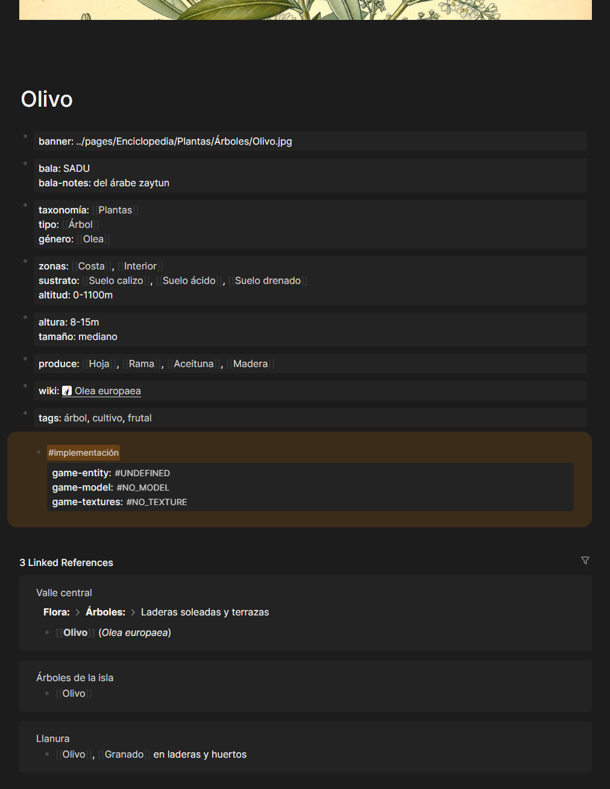

---

title: "Abrazar la imposibilidad: cómo desarrollo este proyecto sin perder el control"
date: 2026-05-11
tags: [meta, herramientas]
---

## Contexto

Hace pocos días compartí otro artículo sobre el diccionario procedural con algunos amigos, y volvió a salir el tema de la complejidad del proyecto que intento abarcar. Negar esta obviedad sería de necios, y es por esto que los últimos años me enfrenté en varias ocasiones a la desmotivación. Soy plenamente consciente de que probablemente nunca termine el desarrollo.

Una vez que aceptas esa imposibilidad, es liberador.

Llevo al menos ocho años con este proyecto. Años de idas y vueltas, dudas, y momentos de desánimo profundo. Sin embargo, tras el nacimiento de mi hijo (y un borrón de dos años en los que la crianza y el trabajo me dejaron con pocas energías y aún menos intención de dedicar mi escaso tiempo a este pasatiempo) cambió mi percepción, y dejé de intentar terminarlo. Ahora simplemente avanzo, sin forzar un ritmo concreto y sabiendo que es un hobby sin final definido, sin presión de lanzamiento. Paradójicamente, eso hace que todo fluya mejor.

Sin ningún orden concreto, comentaré algunos de los puntos críticos y colinas en las que pretendo morir durante este largo desarrollo. No son verdades absolutas, sino tan solo mi enfoque en este trabajo artesanal.

## Ganancias compuestas, combo multiplier

Hace no tanto, el proyecto se encontraba muy fragmentado. Hacía el worldbuilding en múltiples documentos de Google, anotaciones en papel, mensajes en chats; tenía al menos tres versiones del juego en Godot, dos pruebas de concepto antiguas en Unity, y los assets creados a lo largo de un lustro estaban dispersos en carpetas. Cruzar referencias era un proceso manual, el tracking de qué faltaba era caótico. Era, pese a todo, funcional, pero ineficiente. Hasta llegué a plantearme hacer un seguimiento en una hoja de cálculo. Cuando te planteas una hoja de cálculo, sabes que algo ha ido muy mal.

Así que, sin la presión por avanzar a toda costa, me planteé cómo podría facilitarme la vida. Anoté qué datos necesitaba encontrar fácilmente de cada asset y decisión tomada, y cómo pensaba usarlos en el desarrollo del juego. Automaticé la creación de una serie de plantillas que debía rellenar en cada nuevo artículo, y descubrí que tener una plantilla con datos en blanco me forzaba a rellenarlos mucho más que el mero conocimiento implícito de todo lo que me faltaba por desarrollar. Ahora, cuando escribo en Logseq sobre cerámica medieval, o sobre urbanismo islámico, sobre flora endémica de la costa, el knowledge graph se genera automáticamente. Así percibo conexiones que no había visto: cómo el tipo de teja que uso en arquitectura conecta con las técnicas que documenté, cómo eso a su vez requiere tipos de arcilla específicos que determinan dónde se pueden construir hornos, cómo los hornos afectan a la ubicación de asentamientos, etc.

Al mismo tiempo, el sistema crea placeholders automáticos (carpetas, archivos) en la estructura del proyecto. Rellenando un valle del juego, preparo el documento sobre un árbol; pongamos, un olivo. En cuanto guardo este nuevo fichero (commit mediante, no hay commit pequeño), varios hooks lanzan scripts de python que añaden todo aquello que sé que necesito definir: Al instante aparecen campos para el modelo 3D, las texturas, efectos de sonido, su nombre en Bala (el conlang de la isla), las zonas de bioma donde aparece naturalmente, qué entidades/recursos produce (como hojas, ramas, frutos, madera, resina), datos sobre suelo y altitud. Y ahora, tras varias semanas de trabajo en el diccionario procedural, también se crea su entrada etimológica en el diccionario de Bala, incluyendo de dónde vienen sus raíces, qué significados relacionados existen, y ejemplos de uso.

Así que escribo una sola vez sobre el olivo. Y, aunque la estructura del proyecto requiere ciertos archivos en ciertos lugares, ahora tengo un único lugar donde consultar todo: qué assets faltan, qué estado de implementación tiene cada uno, si ya existe la traducción al conlang, dónde está integrado ese asset en el escenario o la narrativa. Es un pequeño truco de magia, pero ayuda porque reduce la fricción. Sigo sin tener una sola decisión automatizada ni creo que merezca la pena intentarlo, pero sí que he borrado de mi cabeza la carga mental extra de actualizar decenas de referencias, añadir información en diferentes puntos, comprobar que no haya duplicados o entidades casi idénticas hechas por un señor muy cansado hace varios meses, etc. De esta forma valido contra lo que ya existe, encuentro inconsistencias que había pasado por alto, y cada pequeña aportación abre nuevas vías para integrar todo en una experiencia cohesiva.

## Esto no es un parque de atracciones

El terreno en el que se desarrolla el juego es de aproximadamente 500 kilómetros cuadrados, y tiene elevaciones entre los -100 y los 2650 metros. Se trata de una isla mediterránea ficticia, próxima al norte de África, esculpida por la acción tectónica y volcánica, con geografía compleja: costa variada, interiores con elevaciones, valles, bosques densos en algunas zonas, áridas en otras, matorrales y pastos; todo condicionado por exposición solar, proximidad al mar, vientos dominantes, tipo de sustrato.

Como habréis pensado, no soy capaz de hacer concesiones en cuanto a mi visión del proyecto. Cuando me decidí por esta escala, lo hice por varios motivos:
Por un lado, quería un mundo que se sintiera real en el *traversal*; eso para mí significa que las transiciones entre áreas sean paulatinas, casi imperceptibles. Cada área debe tener un tamaño razonable, creando un ecosistema que funcione por sí mismo. Ha de ser posible que el jugador deambule por, e interactúe con, un terreno sin compresión, donde sea capaz de perderse, aburrirse, encontrar nuevos caminos.

Sé que colocar a mano cada planta y cada piedra es imposible, y que la decisión más sensata para un único desarrollador sería un acercamiento a la generación procedimental. ¡Por suerte, no soy un desarrollador sensato! Si todo es procedural, acabamos con un Daggerfall: algorítmico, repetitivo, sin alma. Los dos extremos fallan. 

Mi estrategia es híbrida. Defino gramáticas de generación: parámetros como elevación, distancia al mar, tipo de suelo, exposición solar, proximidad a asentamientos humanos, ríos, acuíferos. Esos parámetros alimentan reglas que describen, por ejemplo: "a 400 metros de elevación, en sustrato calcáreo, con exposición norte y a 15 km del mar, la vegetación dominante es pinar de Aleppo con sotobosque de matorral bajo". Cuando estoy contento con las reglas que he definido (tras muchas semanas de Wikipedia, y más botánica de la que nunca imaginé) empleo el modelo de la isla (una serie de texturas de gran tamaño con elevación, precipitaciones, orientación, tipo de sustrato...) generadas a partir de un modelo 3D creado a mano en Blender, y diferentes scripts generan una primera pasada procedural de la isla basada en esas reglas. Esto se traduce en decenas de archivos que definen "tiles" volumétricos, pequeñas secciones de la cuadrícula del mapa del juego. En ellos aparecen referenciados los assets (que pueden existir o no, en cuyo caso aparecerán como meros cubos place-holder). Luego entro en Godot y reviso las zonas que han cambiado o se han generado de cero. Como todas las entidades (árboles, piedras, arbustos, nidos de pájaros...) tienen su equivalencia en Godot, puedo manipularlas ajustando densidades, creando claros, añadiendo zonas de interés locales, veredas... y poco a poco retiro la monotonía donde creo que es necesario. Quizá esto desilusione a alguien, pero si lo pensamos, a nosotros también se nos ha dado un planeta que ya tenía sus particularidades. No hemos decidido la incidencia solar ni la orografía del terreno, ni las especies endémicas. Ajustamos aquí y allá donde nos es necesario (y donde no) y lo hemos aceptado como normalidad.

Por cierto, sobre las zonas de interés y las zonas monótonas: La realidad también tiene zonas monótonas, insípidas. Creo que los jugadores no necesitan que todo sea memorable, pero sí necesitan que sea *creíble*. Hay juegos en los que el espacio se condensa con trucos propios de ferias y atracciones, y aquello que capta la atención se destila hasta tal punto que tan solo queda lo mínimo necesario para vender la ilusión. Creo que debemos perdernos más, aburrirnos más, y disfrutar lo rutinario. Proporcionar ese balance entre autenticidad, variedad, calma, y momentos de descubrimiento (incluso sorpresas cuidadosamente distribuidas) es lo que estas herramientas automáticas me permiten. Cada entidad (árbol, roca, matorral, elemento de arquitectura) es un objeto real en el mundo, editable manualmente. Puedo iterar sin reconstruir desde cero.

Esta decisión de no hacer un parque de atracciones viene de una obsesión que llevo arrastrando una década: Quiero que cada decisión del jugador, por pequeña que sea, se acumule como una bola de nieve. Que nada sea verdaderamente insignificante. Que un gesto leve, un cambio mínimo en la simulación, de otra forma invariable, tenga consecuencias que se propaguen. Eso es lo que intento: que el jugador entienda, visceralmente, que sus actos tienen repercusiones reales, sin importar la escala.

## Las limitaciones hacen que el arte florezca. A veces.

Siempre que hablo de este proyecto, una de las primeras cosas que menciono es que toda la simulación en el juego es 100% determinista.

Vale. Pero, ¿a qué me refiero con esto? En este caso, determinismo completo significa que si guardo una partida en un ordenador A y la cargo en el ordenador B —una máquina completamente diferente, con arquitectura diferente, drivers diferentes, GPU de otra compañía— cuando retomo el juego (la simulación), los resultados son idénticos paso a paso, fotograma a fotograma, bit a bit.

Es una limitación extrema. La mayoría de lenguajes y plataformas no lo garantizan. Las operaciones de punto flotante varían entre arquitecturas x86 y ARM, y entre CPUs de diferente generación. Las tarjetas gráficas son todavía más impredecibles: su paralelismo, su caché, sus drivers... todo puede hacer que dos lecturas del mismo dato en contextos ligeramente diferentes produzcan resultados que difieran ligeramente. Los hilos se pueden ejecutar en orden impredecible. Los drivers gráficos cambian comportamiento de versión a versión. ¿Qué ocurre cuando pequeñas incoherencias se acumulan a lo largo de decenas de miles de milisegundos? Literalmente, la definición de caos.

Una de las decisiones que he tomado para acercarme al determinismo es emplear aritmética de punto fijo: cálculos exclusivamente con enteros, sin coma flotante. En GPU significa repensar algoritmos que típicamente dependen de precisión flotante. He logrado realizar simulaciones con punto fijo en algunos de mis proyectos de prueba (como cg-pipes, que se encarga de simular una red de tuberías, flujos de agua, sistemas de distribución) y funcionan bien, y aún son relativamente rápidos, pero la implementación y el debugging me parecen más lentos. Quizá por falta de práctica.
Además, este determinismo tan férreo e innecesario, que nadie me ha pedido, se extiende hasta el punto de no emplear resultados aleatorios en ninguna sección del juego, ni siquiera con una semilla fija que permitiría determinismo.

Podéis imaginar que el desarrollo está siendo lento. Un proyecto que probablemente durará aún una década entera necesita algo innegociable: estabilidad. Hace falta un control absoluto sobre los procesos, herramientas que no me abandonen, dependencias que pueda mantener yo mismo si es necesario. De ahí viene el resto de decisiones técnicas.

## Inmersión total

Mi acercamiento al worldbuilding no me permite inventarlo de la nada. Como en el resto de mi labor creativa, lo que hago es responder a los estímulos del mundo real. Y, si quiero dar réplica en forma de un juego simulador, necesito *saber* cómo funciona el mundo que estoy construyendo.

Por supuesto, conocer un mundo para proponer uno nuevo requiere tiempo. Si bien estoy ya cerca de los 40 años de vida, no puedo decir que me haya pasado cuatro décadas aprendiendo en profundidad los entresijos de la existencia. Así que, desde hace unos años, me he dedicado en un esfuerzo activo a aprender lo suficiente como para creerme en el derecho de sugerir mejoras.

Estoy leyendo "The Unfolding of Language" de Guy Deutscher. Entre este libro, mucha Wikipedia y cientos de recursos online bastante fiables, intento hacerme una idea de cómo evolucionan las lenguas, cómo se crean sistemas de raíces gramaticales, qué diferencia unas lenguas de otras. He estudiado las raíces de tres consonantes del árabe, investigo sobre idiomas como el copto o el igbo, y por supuesto nunca puedo dar más de un par de clicks antes de darme de bruces con el indoeuropeo. Todo eso lo macero y filtro en Bala, el conlang que se emplea en el juego, para que tenga una lógica interna coherente, creíble. Pretendo emplear un lenguaje que se pueda hablar y no sea una mera actuación caricaturizada, de las que nos indican que hemos topado con exóticos extraños.

Leo sobre flora endémica: variedades de frutales y cítricos, sus requerimientos edáficos (¡ahora sé lo que significa edáfico!), altitudes donde crecen, períodos de cosecha. Veo documentales sobre la técnica de cuerda seca en azulejos, sobre cerámica arquitectónica medieval, sobre la Mezquita de Córdoba y la Alhambra; me inspiro en yacimientos descubiertos por toda la geografía de este policrómico país, y luego todas estas técnicas las trato de replicar en el juego, adaptadas a sus posibilidades y en base a una cultura nueva. Estudio sistemas ancestrales que funcionaron durante milenios: pozos provenzales, sistemas pasivos de climatización, distribución de agua sin bombas mecánicas.

Estoy terminando "Manifiesto del Tercer Paisaje" de Gilles Clément para entender cómo los espacios menos cultivados, los márgenes, generan biodiversidad espontánea. "The Long View" de Richard Fisher sobre cómo percibimos el tiempo, el cambio a largo plazo—crucial cuando describes una civilización estacionaria, que no crece, que respeta equilibrios. Me informo sobre cultivos sostenibles y perma-cultura.

Sé que podría dar un montón de explicaciones plausibles y montar un andamiaje básico sobre el que apoyar el mundo del juego, pero yo sabría que está hueco. Y creo que los jugadores también. Así que para todo lo que acabe en el entorno jugable, investigo. Quiero saber cómo se hace cerámica esmaltada, por qué ciertos diseños funcionan mejor, cómo se construye en piedra sin mortero, cómo funcionan sistemas de riego en climas mediterráneos, la utilidad de las calles que serpentean, los toldos, y las acequias; qué causas determinan que una región tenga olivares y otra viñedos. Entender eso me permite plasmar detalles en el juego que son *consistentes*, que no suenan a magia porque les doy base real, arqueológica, botánica.

Es un proceso lento, pero me permite intercalar diferentes tipos de tareas.

## El método picaflor

No puedo concentrarme en una única rama de trabajo. Mi ADHD no lo permite. O, cuando lo hace, es de una forma tan obsesiva que roza lo dañino.

Llevo toda la vida luchando contra las distracciones sin éxito. Sé que no soy capaz de rendir en una tarea que se prolonga durante todo el día, necesito mis cambios de aire. Así que, de un tiempo a esta parte, acepto esta limitación como una oportunidad. Salto del código que simula las físicas a vocabulario para el conlang Bala, luego a diagramas de arquitectura, o al guión; luego de nuevo a código.

Revoloteo entre las diferentes facetas sin culpa, a veces tras pocas horas, pero cuando finalmente integro esas piezas tan aparentemente inconexas, descubro que los avances son mayores que cuando he trabajado linealmente.

Tengo además varios simuladores que desarrollo en paralelo como pruebas de concepto: cg-pipes (simulador de tuberías, desagües, sistemas de agua), cg-upscalers (shader custom de upscaling de texturas en texture-space), tts_conlang (text-to-speech para generar voces de NPCs en Bala), ORUGA (fantasy console con máquina virtual y scripting, que se usará dentro del juego). Cada uno nace para ensayar un único concepto. Si el proyecto principal se atasca puedo saltar a uno de esos, validar la idea en aislamiento, luego integrarlo o descartarlo.

Por otro lado, si una de esas pruebas de concepto funciona por sí misma, puedo convertirla en un minijuego independiente, que sirve para validar mecánicas del proyecto a largo plazo con jugadores reales.

---

El control técnico es un requisito, pero solo cimienta. Lo que de verdad motiva esta obra —sí, digo obra— es una respuesta al mundo que me rodea, experimentado por mí mismo; mi propia propuesta de cómo podría ser. Es un intento por replantear nuestra relación con el mundo capitalista, con el trabajo. Qué significa realmente triunfar, qué nos aporta felicidad genuina. Qué nos hace humanos. Creo que solo puedo responder honestamente sobre aquello que he vivido, estudiado, hecho, errado, experimentado. Y por eso, cuando pretendo abordar tantas cosas, debo aprenderlas de verdad. Debo vivirlas.
